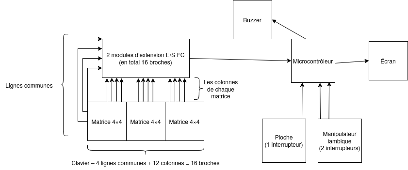

# Dispositif multifonctionnel de code Morse

| | |
|-|-|
|`Auteur` | AXENIE George‐Cătălin

## Description

Ce projet propose un dispositif dédié à la pratique du code Morse, qui comprend trois fonctionnalités principales : **production**, **décodage** et **entraînement**.

La partie **production** permet à l’utilisateur d’accéder à un menu où il peut régler la vitesse de transmission et introduire un texte. Le dispositif convertit alors ce texte en code Morse et le lit à la vitesse choisie.

La partie **décodage** propose un mode interactif où l’utilisateur peut transmettre du code Morse de deux manières : soit à l’aide d’une **pioche** simple, auquel cas le progamme s’adapte dynamiquement à la vitesse de l’utilisateur, soit via un **manipulateur iambique**, fonctionnant avec une vitesse de transmission prédéfinie. Le dispositif décode en temps réel le code Morse saisi et affiche le texte correspondant à l’écran.

La partie **entraînement** consiste à afficher une liste de mots générés aléatoirement que l’utilisateur doit transmettre en utilisant l’une des méthodes de saisie disponibles. À la fin de l’exercice, le dispositif calcule et affiche la vitesse moyenne de transmission.

La saisie du texte et l’intéraction avec le programme s’effectuent au moyen d’un **clavier intégré**.

## Motivation

Bien que son utilisation dans les télécommunications ait reculé, le code Morse conserve une communauté active d’amateurs et de passionnés. Ce dispositif est conçu pour les aider à s’entraîner et à perfectionner leur maîtrise du code Morse.

## Architecture

### Schéma fonctionnel

### Schéma

### Composants

| Appareil | Utilisation | Prix |
|----------|-------------|------|
| Arduino Nano | Carte à microcontrôleur | [24,99 RON](https://www.optimusdigital.ro/ro/compatibile-cu-arduino-nano/1686-placa-de-dezvoltare-compatibila-cu-arduino-nano-atmega328p-i-ch340.html)
| 3 micro‐interrupteurs | Pioche (1) et manipulateur iambique (2) | [3 × 3,27 RON](https://ardushop.ro/ro/electronica/1787-microswitch-6427854027078.html)
| Kit platine de prototypage + fils + module d’alimentation | Prototypage | [34,58 RON](https://www.emag.ro/kit-breadboard-830-gauri-65-fire-modul-tensiune-alimentare-mb102-jh027/pd/DY1YP6BBM/)
| 3 modules de clavier matriciel 4×4 | Saisie texte | [3 × 4,97 RON](https://ardushop.ro/ro/butoane--switch-uri/295-modul-tastatura-matriciala-4x4-6427854003126.html)
| 2 modules d’extension E/S I²C PCF8574 | Extension E/S pour clavier | [2 × 9,96 RON](https://ardushop.ro/ro/comunicatie/2019-modul-de-expansiune-io-i2c-pcf8574-6427854030788.html)
| Écran OLED 0,96 pouces I²C 128×64 px | Écran | [21,78 RON](https://ardushop.ro/ro/display-uri-si-led-uri/818-display-oled-096-i2c-iic-albastru-6427854010636.html)
| Buzzer passif | Son | [4,03 RON](https://ardushop.ro/ro/difuzoare-si-buzzere/1724-1283-buzzer.html#/333-tip-pasiv)

### Bibliothèques

| Bibliothèque | Description | Utilisation |
|--------------|-------------|-------------|

## Journal

### Semaine 4 – 10 mai

### Semaine 11 – 17 mai

### Semaine 18 – 24 mai

## Liens de référence
